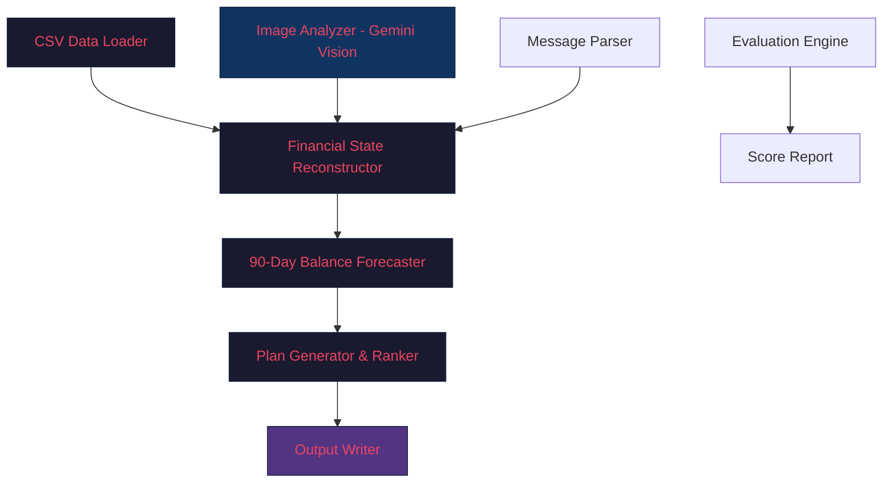

# Buy or Wait? — Implementation Plan

> **HackerRank Orchestrate September 2026**
> Deadline: **2026-09-13T18:00:00+05:30** (~22 hours remaining)

## Overview

Build an AI-powered financial agent that processes 250 user requests, each asking "Can I afford this?". For each request, the agent must reconstruct the user's financial state, forecast 90 days of cash flow, and recommend the safest payment approach.

---

## User Review Required

> [!IMPORTANT]
> **API Key Setup Required**: You selected Google Gemini. Before we start coding, you need to:
> 1. Go to [Google AI Studio](https://aistudio.google.com/apikey)
> 2. Sign in with your Google account
> 3. Click **"Create API Key"**
> 4. Copy the key — we'll store it as an environment variable: `GEMINI_API_KEY`
>
> The free tier gives you **15 RPM for Gemini 2.0 Flash** which is sufficient for 250 requests with batching.

> [!WARNING]
> **GitHub Account**: You mentioned wanting to add this to your GitHub. We'll set up a new remote after building the solution. Please confirm your GitHub username so I can help configure it.

---

## Architecture



---

## Proposed Changes

### Phase 1: Project Setup & Dependencies

#### [NEW] `code/requirements.txt`
- `google-genai` (Google's Gemini SDK)
- `pandas` (CSV processing)
- `Pillow` (image loading)
- `python-dotenv` (env variables)

#### [NEW] `.env`
- `GEMINI_API_KEY=<your-key>`
- `GEMINI_MODEL=gemini-2.0-flash` (free tier, vision-capable, fast)

---

### Phase 2: Data Loading Layer

#### [NEW] `code/data_loader.py`
Load all CSV files into structured dictionaries/dataframes:
- `load_financial_profiles()` → dict keyed by `user_id`
- `load_financial_events()` → dict keyed by `user_id` (list of events per user)
- `load_requests()` → list of request dicts
- `load_sample_requests()` → list with ground-truth output columns
- `load_payment_options()` → dict keyed by `request_id`
- `load_messages()` → dict keyed by `user_id` + `request_id`
- `load_images()` → dict keyed by `related_event_id`
- `load_exchange_rates()` → dict keyed by `(date, from_currency, to_currency)`

Key data cleaning:
- Parse dates to `datetime.date` objects
- Parse amounts to `float`, handle blanks (flag for image extraction)
- Parse pipe-separated fields into lists
- Parse booleans (`true`/`false` → Python bool)

---

### Phase 3: Image Amount Extraction (Gemini Vision)

#### [NEW] `code/image_extractor.py`
- For each of the 16 images in `images.csv`, send the PNG to **Gemini 2.0 Flash** with a structured prompt:
  ```
  "Extract the monetary amount from this financial document. 
   Return ONLY the numeric amount (no currency symbol, no commas). 
   This is for event {event_id} of user {user_id}."
  ```
- Cache results to `code/image_cache.json` to avoid re-calling the API on reruns
- Validate: amount must be a positive number
- Fill the blank `amount` field in the corresponding `financial_events` row

---

### Phase 4: Financial State Engine (Deterministic Core)

This is the heart of the system — no LLM needed here, pure computation.

#### [NEW] `code/financial_engine.py`

##### 4a. User State Reconstruction
For each user+request pair:
1. Filter `financial_events` for this `user_id`
2. Apply message-based amendments:
   - Salary changes (increase/decrease/delay)
   - Rent increases
   - Cancelled/failed transactions
   - Pending bonuses (DO NOT count as income)
   - Unpaid leave deductions
3. Apply conflict resolution rules:
   - Explicit cancellation > newer record > settled > safer interpretation
4. Deduplicate events (same event appearing as pending then settled)
5. Classify events: recurring vs one-time, essential vs flexible
6. Detect recurrence patterns (rent monthly on ~2nd, salary on ~15th, etc.)
7. Convert foreign currency amounts using `exchange_rates.csv`

##### 4b. 90-Day Balance Forecaster
```python
def forecast_90_days(user_profile, events, request_date, payment=0):
    """
    Simulate balance for each day in [request_date, request_date + 90].
    Returns: min_balance across all days, daily_balances array
    """
    balance = user_profile['current_available_balance']
    min_balance = user_profile['minimum_balance_to_keep']
    
    # Day 0: deduct the payment
    balance -= payment
    
    # For each day, apply:
    #   - Recurring debits (rent, utilities, subscriptions, loans)
    #   - Confirmed salary credits (only on settlement date)
    #   - Pending scheduled debits
    #   - Do NOT count: pending credits, failed txns, cancelled, unrealized investments
    
    # Check: balance >= min_balance every single day
    # Return whether plan is "safe"
```

##### 4c. Amount Safe to Pay Calculator
```python
def calc_amount_safe_to_pay(user, events, request_date, requested_amount):
    """
    Binary search for the maximum X such that:
    forecast_90_days(payment=X) keeps balance >= min_balance every day.
    Capped at requested_amount.
    """
```

##### 4d. Earliest Full Payment Date Calculator
```python
def calc_earliest_full_payment_date(user, events, request_date, requested_amount):
    """
    For each day in [request_date, request_date + 90]:
    check if paying full requested_amount on that day passes 90-day safety.
    Return the first such date, or None.
    """
```

---

### Phase 5: Plan Generation & Ranking

#### [NEW] `code/plan_generator.py`

For each request, generate all candidate plans and rank them:

##### Candidate Plans:
1. **Full Payment** — pay `requested_amount` on `request_date`
   - Eligible only if `full_payment` in user's `payment_methods_user_will_consider`
   - Safe only if `amount_safe_to_pay >= requested_amount`

2. **Installments** — match a `request_payment_options` row
   - Eligible only if `installments` in user's preferences
   - Must not exceed `max_installment_months`
   - Each payment must pass 90-day safety check
   - Must complete by `desired_completion_date`

3. **Partial Payment** — pay `amount_safe_to_pay` now, rest on `earliest_date_for_full_payment`
   - Eligible only if `allows_partial_payment == true` AND `partial_payment` in user's preferences
   - Must have `0 < amount_safe_to_pay < requested_amount`
   - `earliest_date_for_full_payment <= desired_completion_date`

4. **Wait** — pay in full on `earliest_date_for_full_payment`
   - Eligible only if `full_payment` in user's preferences
   - `earliest_date_for_full_payment` exists and is within 90 days

5. **With Spending Changes** — recalculate after stopping/reducing flexible expenses
   - Only for recurring expenses in user's willing-to-stop/reduce categories
   - Max 3 changes
   - Re-run forecaster with modified events

6. **Not Recommended** — fallback

##### Ranking (strict order):
1. Completes by `desired_completion_date`
2. No spending changes needed
3. Minimize total amount paid
4. Earlier start date
5. Fewer payments
6. Lowest `payment_option_id`

---

### Phase 6: LLM Integration for Decision Explanation

#### [NEW] `code/llm_explainer.py`
- After deterministic computation produces all numeric outputs, use **Gemini 2.0 Flash** to generate the `decision_explanation` field
- Prompt template with all financial facts pre-computed:
  ```
  "Write a 1-2 sentence financial recommendation explanation.
   User currency: {currency}. Balance: {balance}. Min balance: {min_balance}.
   Requested: {amount}. Status: {status}. Method: {method}.
   Payment plan: {plan}. Changes: {changes}."
  ```
- Batch requests (5-10 at a time) for efficiency
- Fallback: generate template-based explanations deterministically if API fails

---

### Phase 7: Output, Evaluation & Submission

#### [MODIFY] `code/main.py`
- Orchestrator that runs the full pipeline:
  1. Load data
  2. Extract image amounts
  3. For each of 250 requests: reconstruct state → forecast → generate plans → rank → select best → generate explanation
  4. Write `output.csv`
  5. Run evaluation on sample requests
  6. Generate usage report

#### [NEW] `code/evaluation/evaluate.py`
- Compare agent output against `sample_requests.csv` (25 ground-truth rows)
- Score each field:
  - `amount_safe_to_pay`: absolute/relative error
  - `affordability_status`: exact match accuracy
  - `recommended_payment_method`: exact match accuracy
  - `payment_plan`: structural match
  - `earliest_date_for_full_payment`: date accuracy
  - `spending_changes_needed`: set match
- Print detailed per-request comparison and aggregate scores

#### [NEW] `code/evaluation/usage_report.md`
- Token counts, API calls, costs — generated after the final run

#### [NEW] `code/README.md`
- Setup and run instructions

---

## Verification Plan

### Automated Tests
1. **Sample Validation** — Run against 25 solved examples in `sample_requests.csv`:
   ```bash
   python code/main.py
   python code/evaluation/evaluate.py
   ```
2. **Schema Validation** — Verify `output.csv` has exactly 250 data rows + header, correct column order, all values within allowed enums
3. **Constraint Checks**:
   - `0 <= amount_safe_to_pay <= requested_amount` for every row
   - Installment plans match a `payment_option_id`
   - Partial payment plans have exactly 2 entries summing to `requested_amount`
   - Spending changes target only flexible recurring expenses
   - `affordable_now` ↔ `earliest_date_for_full_payment == request_date`

### Manual Verification
- Spot-check 5-10 requests with complex scenarios (foreign currency, image amounts, message amendments, spending changes)
- Compare explanation quality with sample explanations

---

## Timeline Estimate

| Phase | Task | Time |
|-------|------|------|
| 1 | Setup, dependencies, .env | 15 min |
| 2 | Data loader | 30 min |
| 3 | Image extraction (16 images) | 20 min |
| 4 | Financial engine (core logic) | 2-3 hours |
| 5 | Plan generator & ranker | 1-2 hours |
| 6 | LLM explainer | 30 min |
| 7 | Main pipeline + evaluation | 1 hour |
| — | Testing & debugging | 1-2 hours |
| — | **Total** | **~6-8 hours** |

---

## Open Questions

> [!IMPORTANT]
> 1. **API Key**: Have you created your Gemini API key yet? We need it before Phase 3 (image extraction).
> 2. **GitHub Username**: What's your GitHub username so I can configure the remote for your fork?
> 3. **Do you want me to proceed immediately** after you confirm, or would you like to review/adjust the plan first?
